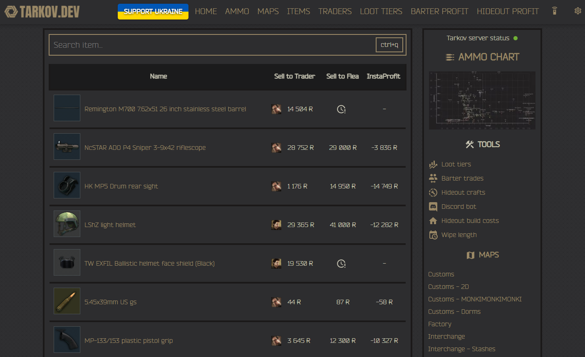

# tarkov.dev 💻

[](https://github.com/the-hideout/tarkov-dev/actions/workflows/deploy.yml) [](https://github.com/the-hideout/tarkov-dev/actions/workflows/ci.yml) [](https://github.com/the-hideout/tarkov-dev/actions/workflows/codeql-analysis.yml)  [](https://discord.gg/WwTvNe356u)

 


This is the source code for the official [tarkov.dev](https://tarkov.dev) website.

View Escape from Tarkov information about items, barters, trades, flea market prices, quests, maps, hideout profits, and so much more!



## Local Development 🔨

To build and test the site locally just follow the steps below:

1. Install dependencies:

    ```bash
    npm install
    ````

1. Start development server:

    ```bash
    npm start
    ```

1. Access the site: [localhost:3000](http://localhost:3000/) 🎉

> Note: You can update data with: `npm run prebuild`

## VS Code Dev Container
1. Open VS Code command pallet:
    ```
    cmd + shift + p / ctrl + shift + p
    ```

2. Start the dev container:
    ```
    > Dev Containers: open folder in container...
    ```
3. Select local path to tarkov-dev repo

4. After the container builds and starts it will auto run `npm install && npm start`

5. Access the site: [localhost:3000](http://localhost:3000/) 🎉

## History 📚

This project ([tarkov-dev](https://github.com/the-hideout/tarkov-dev)) is a fork of [tarkov-tools.com](https://github.com/kokarn/tarkov-tools). The original creator [@kokarn](https://github.com/kokarn) decided to shut the site down. In the spirit of open source, a group of developers came together to revive the site in order to continue providing a great website for the Tarkov community and an API to power further development for creators. This project is now 100% open source (see infrastructure section below) and developer first. Our GitHub Organization ([the-hideout](https://github.com/the-hideout)) contains all the repos which power the API, this website, the community Discord bot, server infrastructure, and much more! We are passionate about open source and love pull requests to improve our ecosystem for all.

## We ❤️ Pull Requests

We love pull requests and contributors looking to improve this project! Anything from simple spelling errors, icon updates, fixes for small css bugs or just posting issues to keep track of what needs to be done is greatly appreciated.

## Deployment 🚀

Deploying your changes to production is easy! Just do the following:

1. Open a pull request with your changes
1. Make sure CI is passing (a core member of [the-hideout](https://github.com/orgs/the-hideout/teams/core-contributors) will run CI for you)
1. A core member of [the-hideout](https://github.com/orgs/the-hideout/teams/core-contributors) will run `.deploy to development` to deploy your changes to the development environment for final validation
1. A review will be recieved from a [reviewer](https://github.com/orgs/the-hideout/teams/reviewers) if all looks good
1. A core member of [the-hideout](https://github.com/orgs/the-hideout/teams/core-contributors) will run `.deploy` on your pull request to branch deploy your changes to production
1. If everything goes okay, your PR will be merged and your changes will be auto-deployed to production! ✨

## Updating Languages 🌐

There are two *ways* to update languages on the site:

- Updating the core translations (most common)
- Updating the language that the GraphQL API uses (least common)

### Language Translations

Rather than go into detail here, we have opened a great guide in a GitHub issue for how you can provide translation contributions to tarkov.dev!

> Check out the guide [here](https://github.com/the-hideout/tarkov-dev/issues/175)

### GraphQL API Language Support

To update the supported languages used by the site with the **GraphQL API**, you will need to edit the following file: [`supported-languages.json`](https://github.com/the-hideout/tarkov-dev/blob/main/src/data/supported-languages.json)

> See this [pull request](https://github.com/the-hideout/tarkov-dev/pull/123) for additional context

## Other Parts of the Ecosystem 🌎

- [Stash](https://github.com/the-hideout/stash) - The official tarkov.dev Discord bot
- [Tarkov API](https://github.com/the-hideout/tarkov-api) - The GraphQL API that powers everything
- [Tarkov Data](https://github.com/TarkovTracker/tarkovdata/) - Open source structured data for Escape from Tarkov
- [Tarkov Image Generator](https://github.com/the-hideout/tarkov-image-generator) - Tool to generate images from the local icon cache
- [Tarkov Data Manager](https://github.com/the-hideout/tarkov-data-manager) - Data manager that core contributors to the project can use to update items in the database. It also contains cron jobs that sync database information to our Cloudflare workers for the GraphQL API
- [Cache](https://github.com/the-hideout/cache) - A bespoke caching service to cache frequent GraphQL API queries
- [Status](https://github.com/the-hideout/status) - The official status page for tarkov.dev, api.tarkov.dev, and much more

## Infrastructure 🧱

To learn more about the infrastructure, components, and open source pieces of this project, check out our [infrastructure documentation](https://github.com/the-hideout/.github/blob/main/profile/docs/infrastructure.md#opensource-notice-)

## Contributors 🧑‍🤝‍🧑

Thank you to all of our awesome contributors! ❤️

<a href="https://github.com/the-hideout/tarkov-dev/graphs/contributors">
  
</a>
