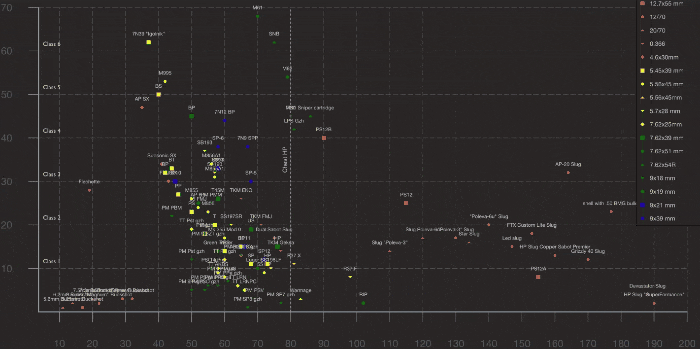

# Tarkov Tools

After reading the great post about [a single visualization for all ammo types](https://www.reddit.com/r/EscapefromTarkov/comments/ebvizg/ammo_table_visualized_on_one_graph/) I decided to create one where it automatically updates depending on the ["official" spreadsheet](https://docs.google.com/spreadsheets/d/1l_8zSZg-viVTZ2bavMEIIKhix6mFTXuVHWcNKZgBrjQ/htmlview?sle=true),

This site isn't as pretty as the original chart but instead includes auto-updates and interactivity.

Simply click the type of ammo you wanna see the stats for and voila!

