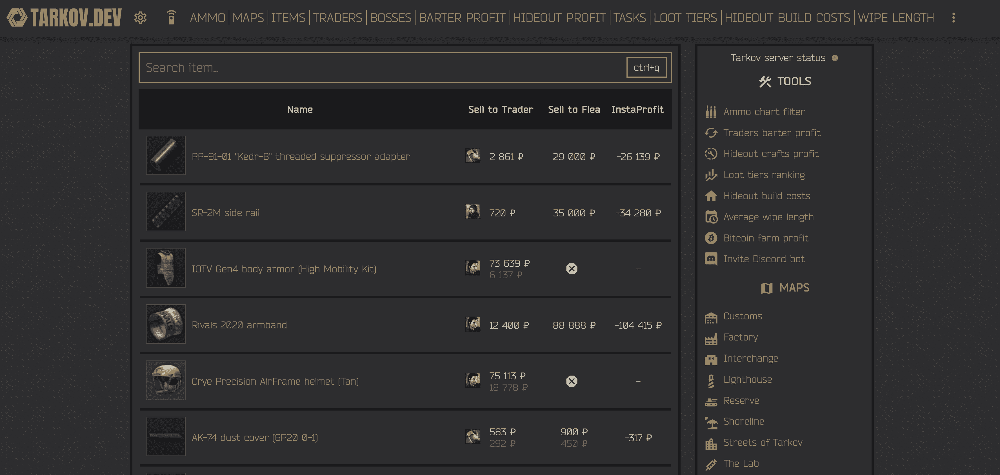

# tarkov.dev 💻

[](https://github.com/the-hideout/tarkov-dev/actions/workflows/ci.yml)

This is the source code for the official [tarkov.dev](https://tarkov.dev) website.

View Escape from Tarkov information about items, barters, trades, flea market prices, quests, maps, and so much more!



## Local Development 🔨

To build and test the site locally just follow the steps below:

1. Install dependencies:

    ```bash
    npm install
    ````

1. Start development server:

    ```bash
    npm start
    ```

1. Access the site: [localhost:3000](http://localhost:3000/) 🎉

> Note: You can update data with: `npm run prebuild`

## History 📚

This project ([tarkov-dev](https://github.com/the-hideout/tarkov-dev)) is a fork of [tarkov-tools.com](https://github.com/kokarn/tarkov-tools). The original creator [@kokarn](https://github.com/kokarn) decided to shut the site down. In the spirit of opensource, a group of developers came together to revive the site in order to continue providing a great website for the Tarkov community and an API to power further development for creators. This project is now 100% opensource and developer first. Our GitHub Organization ([the-hideout](https://github.com/the-hideout)) contains all the repos which power the API, this website, the community Discord bot, server infrastructure, and much more! We are passionate about opensource and love pull requests to improve our ecosystem for all.

## We ❤️ Pull Requests

We love pull request and contributors looking to improve this project! Anything from simple spelling errors, icon updates, fixes for small css bugs or just posting issues to keep track of what needs to be done is greatly appreciated.

## Other Parts of the Ecosystem 🌎

- [Stash](https://github.com/the-hideout/stash) - The official tarkov.dev Discord bot
- [Tarkov Data API](https://github.com/the-hideout/tarkov-data-api) - The GraphQL API that powers everything
- [Tarkov Data](https://github.com/TarkovTracker/tarkovdata/) - Open source structured data for Escape from Tarkov
- [Tarkov Image Generator](https://github.com/the-hideout/tarkov-image-generator) - Tool to generate images from the local icon cache
- [Tarkov Crons](https://github.com/the-hideout/tarkov-crons) - Cron jobs that sync database information to our Cloudflare workers for the GraphQL API
- [Status](https://github.com/the-hideout/status) - The official status page for tarkov.dev, api.tarkov.dev, and much more
