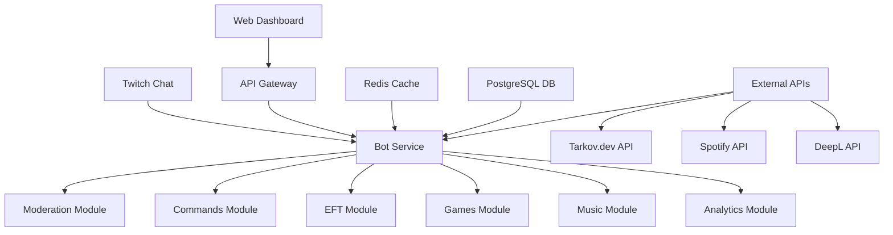
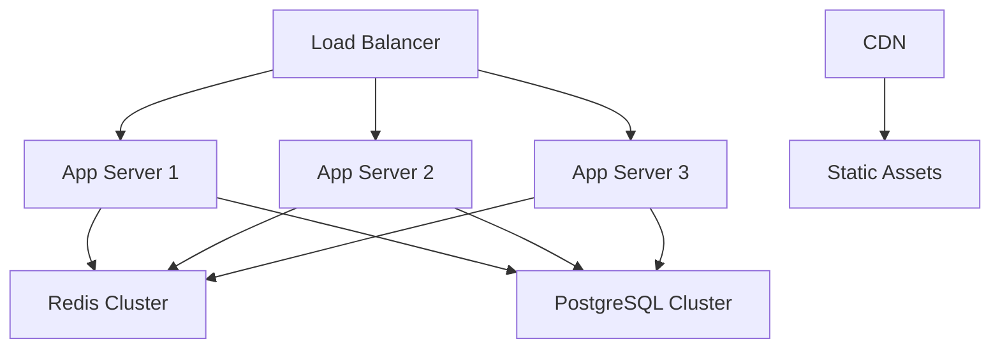

# UltimateTwitchBot Architecture

## System Overview



## Component Details

### 1. Bot Service
- Core Twitch chat integration using tmi.js
- Message routing and command handling
- Event management (subs, bits, follows)
- Channel management

### 2. Modules
#### Moderation Module
- Spam detection
- Bad word filtering
- Toxicity analysis
- Link blocking

#### Commands Module
- Custom command management
- Variable substitution
- Permission handling
- Cooldown management

#### EFT Module
- Flea market price queries
- Trader price comparisons
- Historical price data
- Supply/demand statistics

#### Games Module
- Loyalty system
- Mini-games (trivia, slots, etc.)
- Giveaway management
- Polls and voting

#### Music Module
- Song request queue
- Spotify integration
- YouTube integration
- Playlist management

#### Analytics Module
- Chat statistics
- User engagement metrics
- Command usage tracking
- Revenue analytics

### 3. Data Layer
#### Redis Cache
- Command response caching
- Rate limiting
- Session management
- Real-time data

#### PostgreSQL Database
- User profiles
- Command configurations
- Game state persistence
- Analytics data

### 4. Web Dashboard
- Admin interface
- Bot configuration
- Analytics visualization
- Real-time monitoring

### 5. External Integrations
- Tarkov.dev API for EFT data
- Spotify API for music
- DeepL API for translations
- Twitch API for channel points

## Data Flow

1. **Chat Message Flow**
   ```
   Twitch Chat -> Bot Service -> Moderation Check -> Command Handler -> Response
   ```

2. **Command Processing**
   ```
   Command -> Cache Check -> API Call -> Response Formatting -> Chat Response
   ```

3. **Analytics Flow**
   ```
   Event -> Analytics Module -> Redis Cache -> PostgreSQL -> Dashboard
   ```

## Security Considerations

1. **Authentication**
   - OAuth2 for Twitch login
   - JWT for API access
   - Role-based access control

2. **Data Protection**
   - Encrypted credentials
   - Secure API keys
   - Rate limiting
   - Input validation

3. **Monitoring**
   - Error tracking
   - Performance metrics
   - Security alerts
   - Usage analytics

## Deployment Architecture



## Scaling Strategy

1. **Horizontal Scaling**
   - Multiple bot instances
   - Load balanced API servers
   - Redis cluster
   - PostgreSQL replication

2. **Caching Strategy**
   - Redis for hot data
   - CDN for static assets
   - API response caching
   - Database query caching

3. **Monitoring**
   - Prometheus metrics
   - Grafana dashboards
   - Error tracking
   - Performance monitoring 